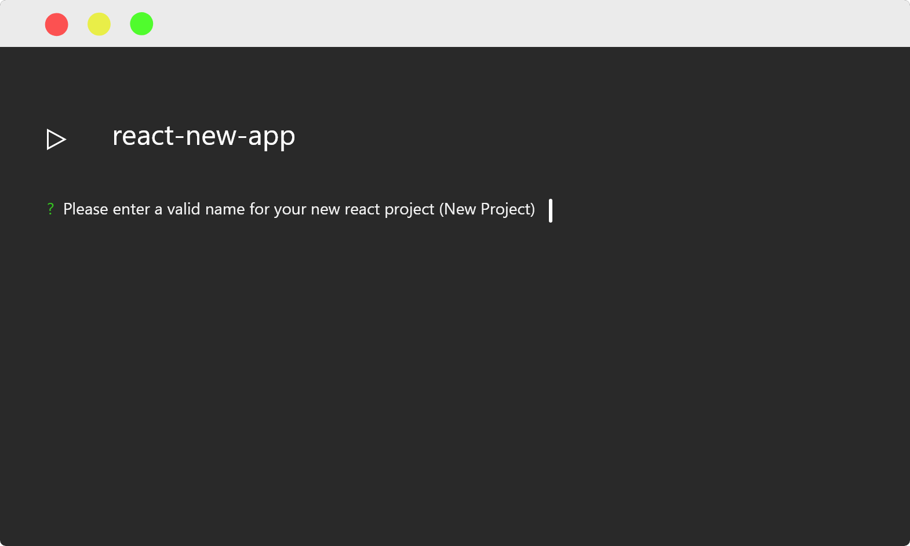
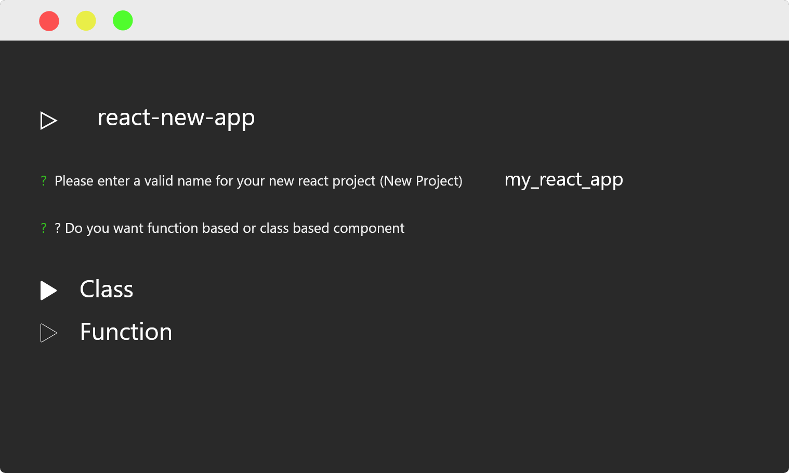
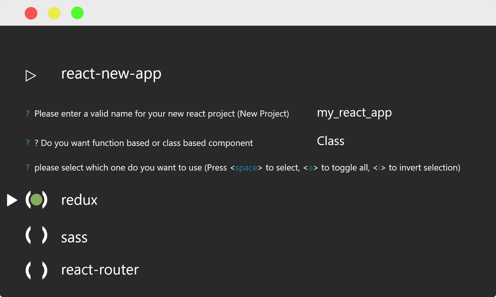
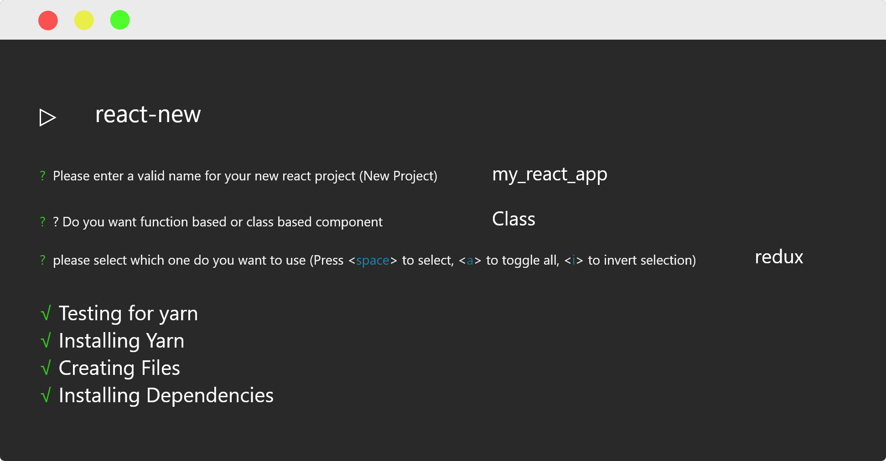

# REACT-NEW

---

### Description: create new react app in seconds with selections

---

## Installation

```sh
    npm install react-new -g
```

or

```sh
    yarn global add react-new
```

## Usage

```sh
    react-new
```

- give name to project



- select component kind



- choose options (will add future)



- wait for dependencies and steps



### when finished

- cd {project name}

for example

```sh
    cd my_react_app
```

- npm start

```sh
    npm start
```

### DONE 🎉🎉🎉

Author : AhmetEnesKCC

github : https://github.com/AhmetEnesKCC

project github : https://github.com/AhmetEnesKCC/react-new

used dependencies :

- chalk (for make colored console outputs)

- clear (for clear console)

- inquirer (for cli ui)

- execa (for execute functions)

- listr (for make installations steps more attractive )

## Thank You !!!
